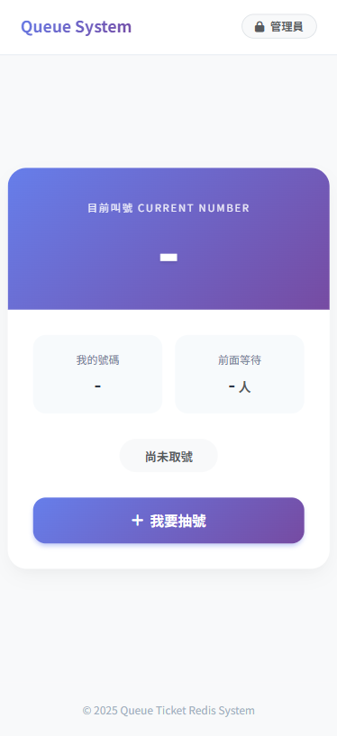
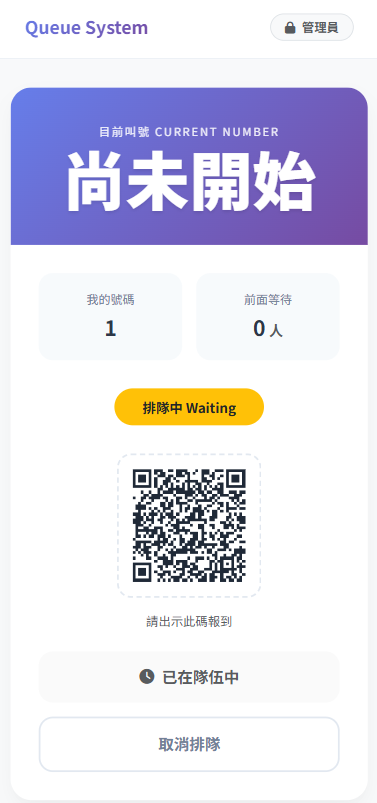
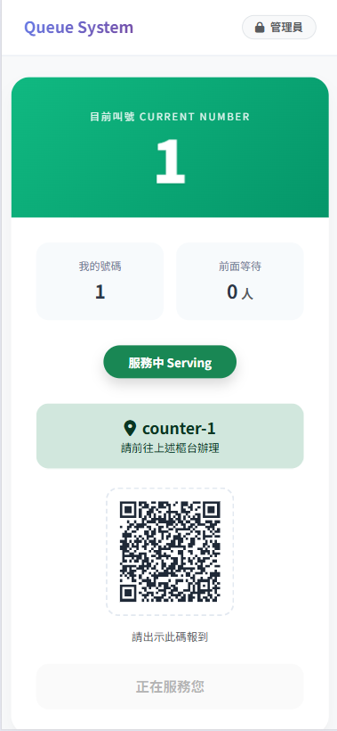
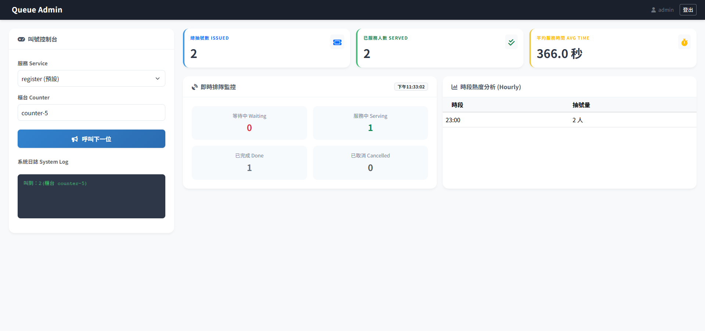

# queue-dbms-project


> **114學年度第一學期 資料庫管理 個人小專題**
>
> * **系級：** 資訊管理系
> * **學號：** 11346064
> * **Live Demo:** [https://queue.xiandbms.ggff.net](https://queue.xiandbms.ggff.net)

---

## 1. 緒論 (Introduction)

### 1.1 研究背景
在熱門店家或服務場所，傳統的實體排隊方式不僅造成現場擁擠，更讓顧客陷入漫長的「盲目等待」。實體叫號機硬體成本高昂且消耗紙張，不符合現代 ESG 環保趨勢。

### 1.2 研究動機
本專案提出 **「手機即叫號機 (BYOD)」** 的概念，利用 Redis 的高效能特性，打造一個 **跨平台、低延遲、高併發** 的雲端叫號系統。旨在解決顧客的「過號焦慮」，並透過即時推播讓顧客能靈活運用等待時間。

### 1.3 研究目的
1.  **即時性 (Real-time)：** 利用 Redis Pub/Sub 與 SSE 技術，達成 < 0.1 秒的狀態同步。
2.  **跨平台整合：** 同時支援 **Web (掃碼)** 與 **LINE 官方帳號** 操作。
3.  **數據決策：** 提供管理後台即時監控流量與「時段熱度分析」。

---

## 2. 作品介紹 (Project Overview)

### 2.1 系統架構 (System Architecture)
本系統採用 **雲端原生 (Cloud Native)** 的分離式架構，確保高可用性與安全性。

* **前端：** HTML5, Bootstrap 5, JavaScript (EventSource/SSE)。
* **後端：** Python Flask, Gunicorn (Threaded Worker)。
* **資料庫：** Redis Cloud (Upstash/Redis Labs)。
* **部署設施：** Render (PaaS) + Cloudflare (WAF & CDN)。

### 2.2 操作流程 (Workflow)
1.  **取號：** 使用者掃描 QR Code 或在 LINE 點擊選單，系統生成唯一 Token 並回傳票號。
2.  **等待：** 手機畫面透過 SSE (Server-Sent Events) 即時跳動，顯示前方等待人數。
3.  **叫號：** 管理員在後台點擊「叫下一位」，系統自動廣播並更新狀態。
4.  **通知：** 使用者收到 LINE 推播與網頁震動提醒，前往櫃台。

### 2.3 作品亮點 (Highlights)
* **Token 雙重驗證機制：** 解決了 LINE 跳轉瀏覽器時 Session 遺失的問題，並防止惡意使用者透過修改網址 ID 偷看他人票券。
* **智慧自動結案：** 解決了「櫃台忘記按結束」導致系統卡死的問題。當呼叫下一位時，系統會自動搜尋並結案上一位 `Serving` 的顧客。
* **廣播器架構 (Broadcaster Pattern)：** 為解決 Redis 免費版連線數限制，實作了全域廣播器，僅使用 **1 條** Redis 監聽連線即可服務大量前端使用者。

---

## 3. 引用技術 (Technologies)

本專案深入應用了 **6 項** Redis 進階功能，解決了傳統 SQL 資料庫難以處理的痛點：

### Redis 進階功能 vs. 傳統 SQL

| Redis 功能 | 本專案應用場景 | 解決了什麼問題？ (vs 傳統 SQL) |
| :--- | :--- | :--- |
| **1. Streams** | 排隊佇列 (Queue) | **順序保證**：取代 SQL 複雜的鎖表機制，實現高效 FIFO 佇列，支援 Consumer Group。 |
| **2. Pub/Sub** | 即時廣播系統 | **低延遲通知**：實現 WebSocket 級別的即時推播，不需要前端頻繁輪詢 (Polling) 資料庫。 |
| **3. RediSearch** | 狀態查詢索引 | **高速計數**：使用 `FT.SEARCH` 瞬間計算「前方等待人數」，無需全表掃描 (`SELECT COUNT`)。 |
| **4. Aggregation** | 時段熱度分析 | **即時分析**：使用 `FT.AGGREGATE` 與 `APPLY` 運算，在資料庫層直接計算每小時來客量，無需 ETL。 |
| **5. Pipelines** | 交易原子性 | **降低延遲**：將寫入 Hash、Stream 與計數器的指令打包發送，大幅降低雲端網路來回時間 (RTT)。 |
| **6. Atomic Locks** | LINE 推播防重 | **併發控制**：利用 `SET NX EX` 實作分散式鎖，防止多個 Worker 同時發送重複的 LINE 訊息。 |

---

## 4. 系統展示 (Screenshots)

### 使用者端 (RWD Design)
極簡設計，支援 QR Code 掃描與即時狀態更新。

| 取號首頁 | 排隊中 (即時跳號) | 叫號通知 (服務中) |
| :---: | :---: | :---: |
|  |  |  |

### 管理後台 (Dashboard)
結合 RediSearch 聚合查詢，即時顯示等待人數、服務狀態與時段熱度分析。


---

## 5. 安裝與執行 (Installation)

### 本地開發 (Local Development)

1.  **Clone 專案**
    ```bash
    git clone [https://github.com/](https://github.com/)[你的帳號]/queue-dbms-project.git
    cd queue-dbms-project
    ```

2.  **建立環境變數 (.env)**
    ```env
    LINE_CHANNEL_SECRET=你的LINE_Secret
    LINE_CHANNEL_ACCESS_TOKEN=你的LINE_Token
    # REDIS_URL=redis://... (若要連線雲端才填，本地留空)
    ```

3.  **安裝依賴套件**
    ```bash
    pip install -r requirements.txt
    ```

4.  **啟動服務**
    ```bash
    # 使用啟動腳本 (自動偵測環境與啟動 Gunicorn)
    ./start.sh
    ```

---

## 6. 結論與心得 (Conclusion)

「最後，我想分享一下這學期做這個個人專案的心得。
坦白說，在做這個題目之前，我以為 Redis 就只是一個『用來做快取 (Cache)』的工具，頂多就是存取速度很快而已！

但在這次實作過程中，我才感受到它的威力！！
我發現它不只是一個資料庫，它根本就是一個超級高效的訊息中心。利用 Streams 來做排隊、用 Pub/Sub 來做即時通知，這些功能如果硬要用傳統 SQL 來寫，光是處理『資料表鎖死 (Locking)』和『不斷輪詢 (Polling)』的問題，可能程式碼會變得非常複雜，效能還不一定好。但用 Redis，幾個指令就優雅解決了。

當然，開發過程絕對不是一帆風順的。其中讓我印象最深刻、也學到最多的，就是『資源管理』這件事。
我記得剛把系統部署上雲端的時候，因為免費版 Redis 只有 30 個連線額度。一開始我沒想太多，每個使用者連進來我都開一條連線，結果才測試沒幾下，系統就直接崩潰給我看，直接噴 Max Connections Reached 的錯誤。

那時候我才意識到，『能跑的程式』跟『能上線的系統』是兩件事！
這個問題逼著我必須去深入研究 Connection Pool (連線池) 的原理，最後我重新設計了後端架構，寫出了一個『廣播器模式 (Broadcaster)』。我讓全域只保留一條連線去監聽 Redis，收到訊號後再由 Python 分發給所有使用者。把原本需要幾百條連線的需求，瞬間降到個位數。

那個『把崩潰修到穩定』的瞬間，是我覺得最有成就感的時候。
另外，像是為了解決 Cloudflare 防火牆 誤擋我的即時連線，還有為了解決 LINE 跳轉瀏覽器的身分驗證問題，我去研究了 WAF 規則和 Token 機制。這些都是課本上學不到，只有真正動手實作、真正踩過坑，才會學到的實戰經驗。

總結來說，這個專案讓我學會的不只是 Redis 的指令，更重要的是學會了『如何在有限的資源下，透過架構設計，去打造一個穩定、安全且高效能的系統』。這是我這學期最大的收穫。
我的報告到這邊，謝謝老師出的作業和AI的指導，謝謝大家。」

---

### 附件與連結

* **Live Demo:** [https://queue.xiandbms.ggff.net](https://queue.xiandbms.ggff.net)
* **GitHub:** [https://github.com/wesleybot/queue-dbms-project](https://github.com/wesleybot/queue-dbms-project)

---
© 2025 X!aN Queue Ticket System Project. All Rights Reserved.
